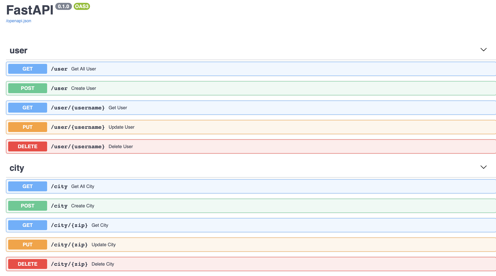

<p align="center"></p>

[](https://codecov.io/gh/Fszta/CrudGen)

[](https://www.gnu.org/licenses/gpl-3.0)
# CrudGen - FastApi crud generator
CrudGen is a CLI tool that allows you to generate & run a CRUD for <a href="https://fastapi.tiangolo.com">FastApi</a> framework.
CrudGen goal is to make simple and fast the process of building SQL Tables and associated crud, only giving a json file describing SQL table attributes as input.

## Features
* SqlAlchemy model generation
* Pydantic schema generation
* Controller generation
* Router generation
* Swagger documentation
* Api automatic start

## Supported plateforms
Developed under Python 3.8.2
<table>
  <thead>
    <tr>
      <th>Operating System</th>
      <th>State</th>
    </tr>
  </thead>
  <tbody>
    <tr>
      <td>Mac OS</td>
      <td>Tested</td>
    </tr>
    <tr>
      <td>Linux</td>
      <td>Tested</td>
    </tr>
    <tr>
      <td>Windows</td>
      <td>Not tested</td>
    </tr>
  </tbody>
</table>

## Usage

```bash
python -m crudgen.app \ 
    --file crudgen/example/example.json \
    --output /Users/fsz/Development/ \
    --start True
```

### Parameters : 
#### Required
* --file: path of the json file describing table
* --output: absolute path of the generated api output directory
* --start: boolean, if true api will start after generation 

#### Optional
* --name: name of the generated api 

Input file content : example.json

```json
{
   "user":{
      "key_identifier":{
         "name":"username",
         "type":"string"
      },
      "fields":[
         {
            "field_name":"id",
            "field_type":"integer",
            "unique":true,
            "primary_key":true
         },
         {
            "field_name":"username",
            "field_type":"string",
            "unique":true,
            "primary_key":false
         },
         {
            "field_name":"registration_date",
            "field_type":"datetime",
            "unique":false,
            "primary_key":false
         },
        {
            "field_name":"city",
            "field_type":"string",
            "unique":false,
            "primary_key":false
         }
      ]
   },
   "city":{
      "key_identifier":{
         "name":"zip",
         "type":"integer"
      },
      "fields":[
         {
            "field_name":"id",
            "field_type":"integer",
            "unique":true,
            "primary_key":true
         },
         {
            "field_name":"zip",
            "field_type":"integer",
            "unique":true,
            "primary_key":false
         },
         {
            "field_name":"country",
            "field_type":"string",
            "unique":false,
            "primary_key":false
         }

      ]
   }
}
```
According to example.json, crud for two tables will be generated : user and city. 
With the previous command, api will start automatically, swagger docs will be accessible at http://0.0.0.0:8080/docs 
You'll find the following page which allows you to try out every endpoints:
<p align="center">
  
</p>


### Fields description
* First field: table's name (user & city in example.json)
* key_identifier: name of the sql attribute use to identify sample and request database
* fields: list of field discribing sql table attributes 

In v0.1-alpha, following types options are supported:
* integer
* string
* boolean
* float
* datetime

An attribute can be use as primary key and / or set as unique

## Next features in v0.1
* Relation between table fields 
* CORS support
* Add more supported types 
* Ability to generate route for file upload
* Fix update endpoint bug
